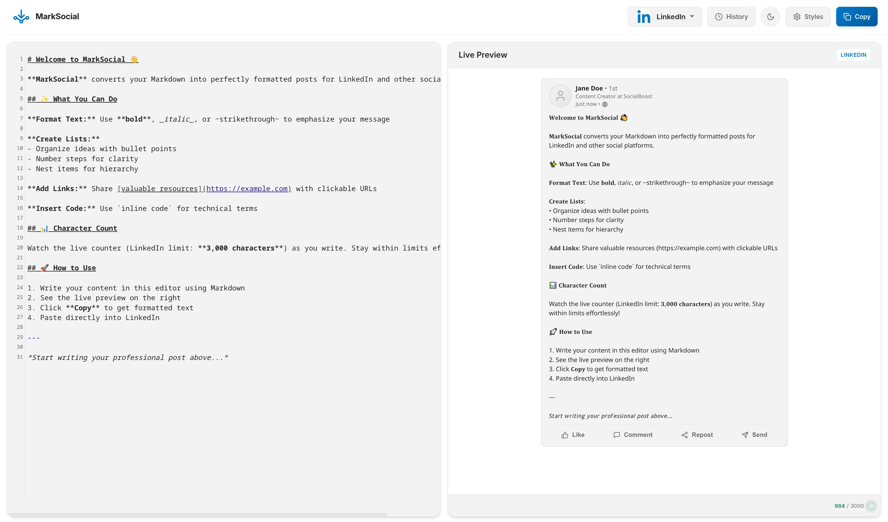

<div align="center">

# 📝 → 📱 MarkSocial

**Write in Markdown. Post anywhere.**

A sleek editor that converts Markdown into perfectly formatted posts for LinkedIn, Twitter/X, Instagram, and 9 other platforms.

**🌐 https://algovyn.com/marksocial/**

[](https://www.typescriptlang.org/)
[](https://react.dev/)
[](https://vitejs.dev/)
[](LICENSE)

<br>



</div>

---

## ✨ What It Does

| Feature               | Description                                                                                                      |
| --------------------- | ---------------------------------------------------------------------------------------------------------------- |
| 🎯 **12 Platforms**   | LinkedIn, Twitter/X, Instagram, Threads, Bluesky, Mastodon, Discord, Reddit, YouTube, Facebook, TikTok, Telegram |
| 👁️ **Live Preview**   | See exactly how your post will look in real-time                                                                 |
| 📊 **Smart Counters** | Platform-specific limits with color-coded warnings                                                               |
| 🧵 **Thread Support** | Auto-splits Twitter threads with navigation                                                                      |
| 💾 **Draft History**  | Never lose your work — auto-saved with timestamps                                                                |
| ♿ **Accessible**     | Full keyboard nav, screen reader support, reduced-motion                                                         |

---

## 🚀 Quick Start

```bash
# Clone and install
git clone <repo-url> && cd marksocial
npm install

# Start dev server
npm run dev
```

Open `http://localhost:5173`

---

## 🎮 How to Use

1. **Select** your target platform from the dropdown
2. **Write** Markdown on the left — syntax highlighting included
3. **Preview** your formatted post on the right
4. **Copy** when ready — formatting options available via ⚙️
5. **Paste** directly into your social platform

---

## 🛠️ Built With

- ⚛️ **React 18** + **TypeScript**
- ⚡ **Vite** for blazing-fast builds
- 📝 **CodeMirror 6** for the editor
- 🎨 **Marked** + **highlight.js** for rendering
- 🧪 **Vitest** for testing

---

## 📦 Scripts

| Command          | Action                   |
| ---------------- | ------------------------ |
| `npm run dev`    | Start development server |
| `npm run build`  | Build for production     |
| `npm test`       | Run test suite           |
| `npm run lint`   | Check ESLint             |
| `npm run format` | Check Prettier           |

---

<div align="center">

**[Report Bug](../../issues)** · **[Request Feature](../../issues)**

Built with ❤️ for content creators who love Markdown.

</div>
